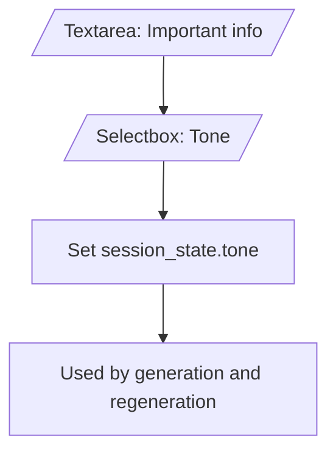
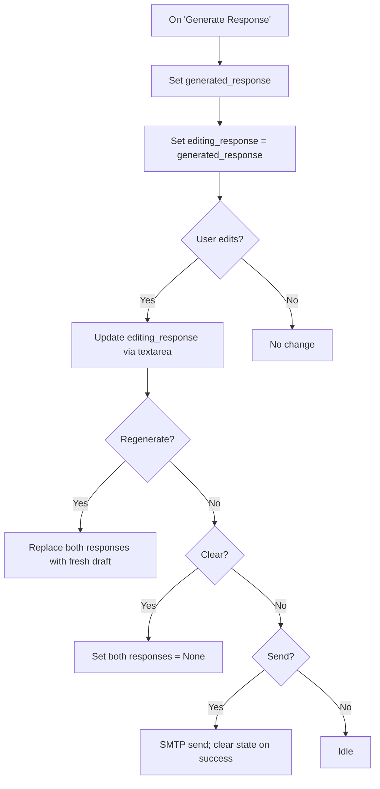

# MailBuddy Flowcharts

These flowcharts document the main operational flows in the MailBuddy project. You can view them directly in Markdown renderers that support Mermaid, or use the ASCII fallbacks below each chart.

> Tip: On GitHub, Mermaid diagrams render automatically in Markdown.

---

## Legend
- Rectangle: action
- Diamond: decision
- Parallelogram: input/output
- Subroutine: external call (IMAP/SMTP/LLM)
- Note: session state updates

---

## 1) IMAP Configuration
```mermaid
flowchart TD
    A[Open 'Email Server Settings'] --> B[/Enter Email, App Password, Server, Port/]
    B --> C{Click 'Configure Email Server'?}
    C -- No --> Z[Idle]
    C -- Yes --> D[[IMAP: connect()]]
    D --> E{Connected?}
    E -- No --> F[Show error; disconnect if needed]
    E -- Yes --> G[[IMAP: ensure_folders_exist()]]
    G --> H{Folders OK?}
    H -- No --> I[Show warning]
    H -- Yes --> J[Set session_state.folder_manager]
    J --> K[Set session_state.imap_configured = True]
    K --> L[[IMAP: disconnect()]]
    L --> Z
```

ASCII fallback:
- Enter IMAP details → Configure → connect()
  - If fail: show error, disconnect
  - If success: ensure_folders_exist() → set imap_configured + folder_manager → disconnect

---

## 2) Folder View (Recent Emails)
```mermaid
flowchart TD
    A{imap_configured & folder_manager?}
    A -- No --> Z[Skip folder view]
    A -- Yes --> B[[IMAP: connect()]]
    B --> C[Build tab list: INBOX + mapped folders]
    C --> D{For each folder}
    D --> E[[IMAP: search_emails(folder, limit=5)]]
    E --> F{Results?}
    F -- Yes --> G[Render subject + sender list]
    F -- No --> H[Show 'No recent emails']
    G --> I[[IMAP: disconnect()]]
    H --> I
    I --> Z
```

---

## 3) Manage Known Contacts
```mermaid
flowchart TD
    A[Load contacts.json via load_contacts()] --> B{Add clicked?}
    B -- Yes --> C[/Enter email/]
    C --> D{Valid & not duplicate?}
    D -- Yes --> E[Append; save_contacts(); toast success]
    D -- No --> F[Info: already present/empty]
    B -- No --> G{Remove clicked?}
    G -- Yes --> H[Pop contact; save_contacts(); toast removed]
    G -- No --> Z[Idle]
```

---

## 4) Triage (Rule-Based)
```mermaid
flowchart TD
    A[/Input: subject_text, email_text, sender_text/]
    A --> B{Click 'Classify Email'?}
    B -- No --> Z[Idle]
    B -- Yes --> C{Any input present?}
    C -- No --> D[Warn: need subject/sender/body]
    C -- Yes --> E[[TriageTask.run()]]
    E --> F[Show category, action, justification]
    F --> G{IMAP configured?}
    G -- No --> Z
    G -- Yes --> H{Move clicked?}
    H -- No --> Z
    H -- Yes --> I[[IMAP: connect()]]
    I --> J[[IMAP: move_email(msg_id, from INBOX to mapped folder)]]
    J --> K[[IMAP: disconnect()]]
    K --> Z
```

---

## 5) Tone Selection & Important Info


---

## 6) Generate → Edit → Regenerate → Clear
```mermaid
flowchart TD
    A[/Sender email, Email content/] --> B[/Important info, Tone/]
    B --> C{Click 'Generate Response'?}
    C -- No --> Z[Idle]
    C -- Yes --> D{email_content not empty?}
    D -- No --> E[Error: provide email content]
    D -- Yes --> F[[LLM generate_email_response()]]
    F --> G[Set generated_response, editing_response]
    G --> H[/Textarea: Edit response/]
    H --> I{Click 'Regenerate'?}
    I -- Yes --> J{email_content present?}
    J -- No --> K[Warn: need content]
    J -- Yes --> L[[LLM generate_email_response()]]
    L --> M[Update generated_response, editing_response; info toast]
    I -- No --> N{Click 'Clear'?}
    N -- Yes --> O[Clear both responses; toast cleared]
    N -- No --> Z
```

---

## 7) Send Reply (SMTP)
```mermaid
flowchart TD
    A{Click 'Send Reply'?}
    A -- No --> Z[Idle]
    A -- Yes --> B[Get editing_response or generated_response]
    B --> C{Sender email present?}
    C -- No --> D[Warn: enter sender email]
    C -- Yes --> E{Response text present?}
    E -- No --> F[Warn: generate response first]
    E -- Yes --> G[[SMTP: send_email(recipient=sender_text, body=edited)]]
    G --> H{Send success?}
    H -- Yes --> I[Success toast; clear response state]
    H -- No --> J[Error toast: failed to send]
    I --> Z
    J --> Z
```

---

## 8) AI Response Generation (Detail)
```mermaid
flowchart TD
    A[/Inputs: email_text, tone, optional important_info/] --> B{Gemini API available?}
    B -- Yes --> C[[Gemini: generate() with prompt conditioning]]
    B -- No --> D[Fallback: template-based response]
    C --> E[Normalize text; return]
    D --> E[Return]
```

---

## 9) Session State Lifecycle (Responses)

